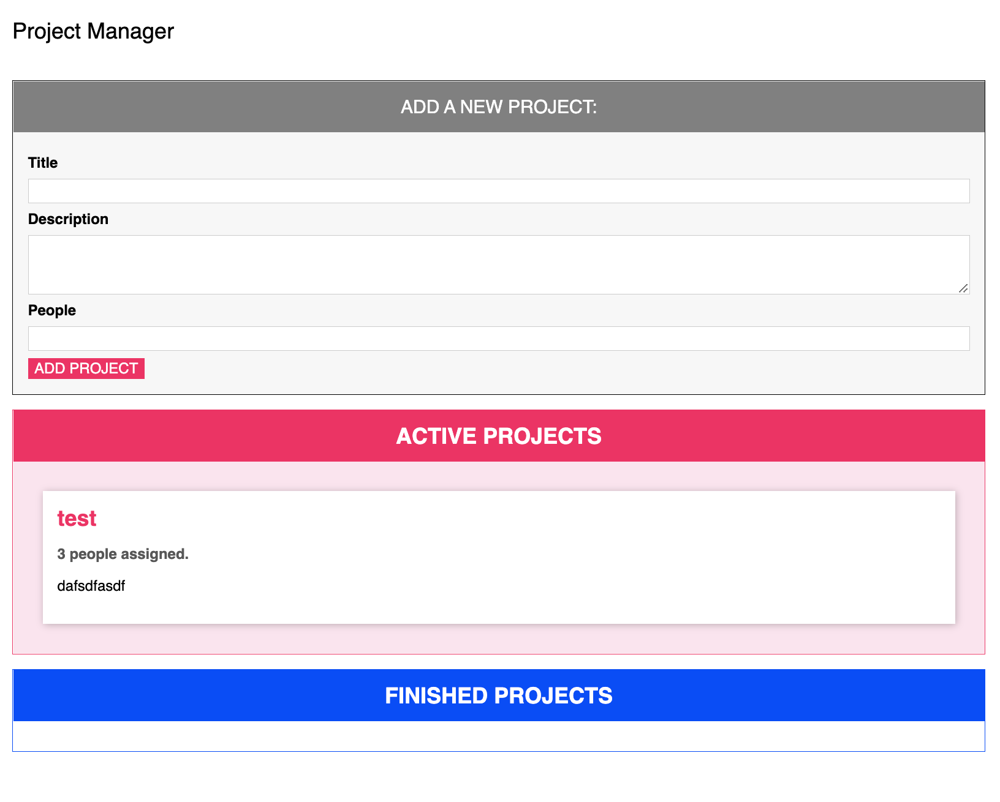

# Task Manager

## Description
This simple app allows for user input regarding projects or tasks, and then keeeps a list of active and finished projects.  The user can drag and drop projects or tasks back and forth from the active list to the finished list.  This project was built with separated typescripts components within the src folder.  When the typescript is compiled it now generates a single file -- bundle.js

## Features
User Input
Drag and Drop Div Elements
Compiled Typescript and Compressed ES6 Javascript

## Tech
TypeScript
JavaScript
ES6 Imports

### Nots:
Imports are made without the '.js' extensions, and the index.html file imports only "bundle.js" which loads in our entire app as a minimized js file.  this is created with the help of Webpack -- and the TS-Loader npm package, which tells Webpack how to compile the typescript files.  Note also that our tsconfig.json file is still set to use an ES6 target, with es2015 module format and the outDir is set to /dist.  Note that Webpack takes care of setting the rootDir for us so we don't need to set it in the ts.config file.

## Setup
npm or yarn install
tsc -w (compile the typescript)
npm or yarn start (runs lit-server on localhost)

## Author
Bart Dority
bdority@griddynamics.com    
Based on the Understanding Typescript course on Udemy with Maximillian Schwartz

